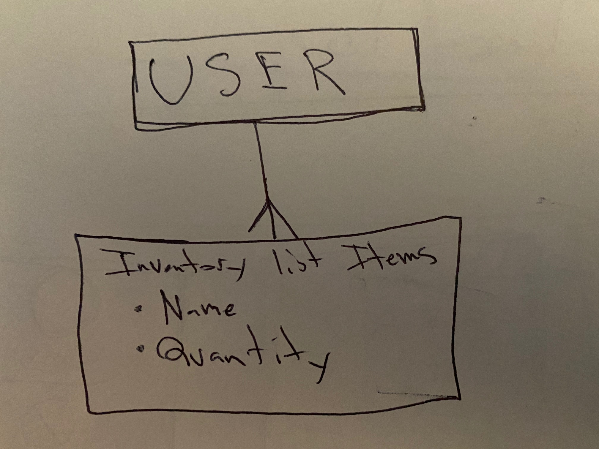

# Inventory API
## Description
    Api for an app in which a user can create, store, and update an inventory list.

# Technolgies used:
* Node.js
* Express.js
* Mongoose
* MongoDB

# User Stories
* As an unregistered user, I would like to sign up with email and password.
* As a registered user, I would like to sign in with email and password.
* As a signed in user, I would like to change password.
* As a signed in user, I would like to sign out.
* As a signed in user, I would like to create an inventory list item with a name and quantity.
* As a signed in user, I would like to update my inventory list item's name and quantity.
* As a signed in user, I would like to delete my inventory list item.
* As a signed in user, I would like to see all my inventory list items but not other users'.

| Verb   | URI Pattern    | Result              |
|:-------|:---------------|:--------------------|
| GET    | `/lists`     | show list of all user's lists|
| POST   | `/lists`     | create a new list        |
| PATCH  | `/lists/:id` | update an existing list        |
| DELETE | `/lists/:id` | destroy an existing list       |

## ERD

# Version 2 Goals:
* Add a quantity typw to item model
* Style the nav bar
* Add the abitlity to multiple, different, lists.